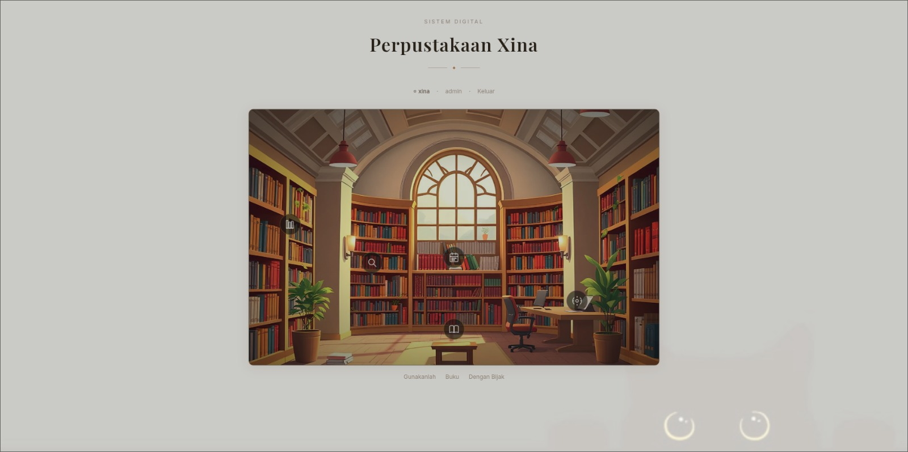
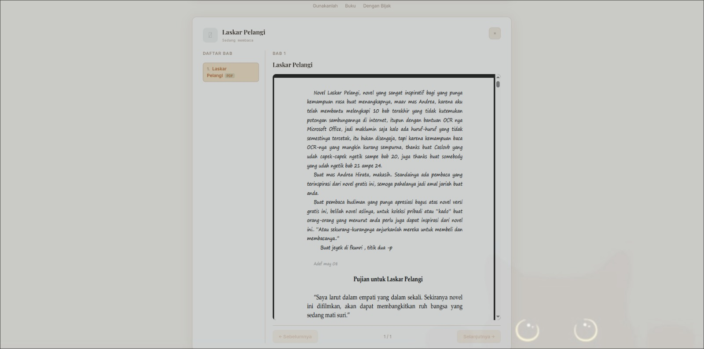
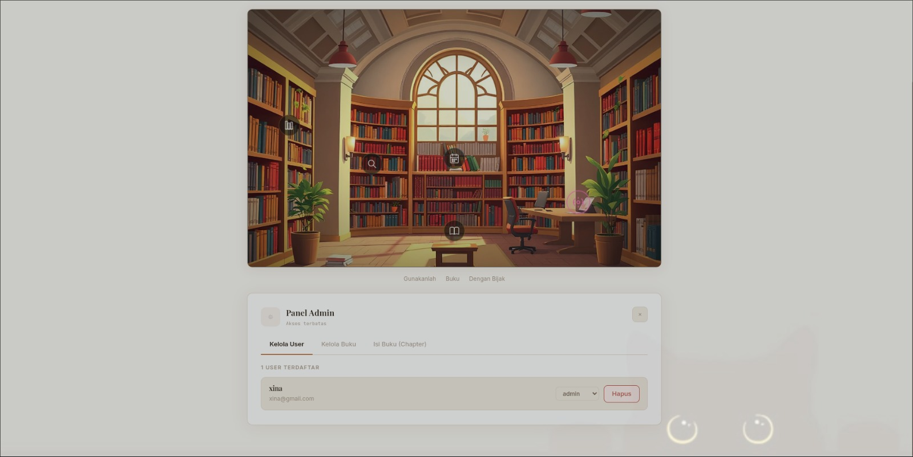

# Perpustakaan Xina

Sistem perpustakaan digital dengan tampilan interaktif — pengguna bisa klik langsung ke rak buku di layar untuk buka fitur-fiturnya.


---

## Fitur

- **Login & register** dengan sistem autentikasi berbasis JWT
- **Baca buku online** — tampilan reader per bab, lengkap dengan navigasi halaman
- **Pinjam buku** — sistem booking dengan tanggal pinjam & kembali
- **Panel Admin** — kelola user, tambah buku, upload chapter (PDF)
- **Hotspot interaktif** — klik area di gambar perpustakaan untuk buka fitur berbeda

---

## Tampilan Aplikasi

**Halaman utama** — klik hotspot di gambar perpustakaan untuk navigasi:



**Reader buku** — baca per bab, bisa scroll dan pindah halaman:



**Panel Admin** — kelola user, buku, dan chapter dari satu tempat:



---

## Tech Stack

| Service | Teknologi | Port |
|---------|-----------|------|
| Auth | Go (Gin) | 8080 |
| User | Spring Boot (Java) | 8081 |
| Book | NestJS (TypeScript) | 8082 |
| Frontend | Next.js | 3000 |
| DB Auth | PostgreSQL | 5435 |
| DB User | PostgreSQL | 5433 |
| DB Book | PostgreSQL | 5434 |

Arsitektur microservices — tiap service punya database sendiri dan bisa dijalankan terpisah.

---

## Cara Jalankan

### Prasyarat

- Docker & Docker Compose
- Git

### Langkah-langkah

```bash
# 1. Clone repo
git clone https://github.com/xian0000000/xina-sistem-perpustakaan.git
cd xina-sistem-perpustakaan

# 2. Setup environment
cp .env.example .env
```

Edit file `.env` dan isi nilainya:

```env
JWT_SECRET=ganti-dengan-secret-panjang-minimal-32-karakter
POSTGRES_PASSWORD=ganti-dengan-password-database
```

```bash
# 3. Jalankan semua service
docker compose up --build
```

Tunggu 1-2 menit sampai semua service selesai build dan healthy.

### Akses Aplikasi

| URL | Keterangan |
|-----|------------|
| http://localhost:3000 | Frontend |
| http://localhost:8080 | Auth API |
| http://localhost:8081 | User API |
| http://localhost:8082 | Book API |

### Stop

```bash
# Stop service
docker compose down

# Stop + hapus data database
docker compose down -v
```

---

## Struktur Proyek

```
xina-sistem-perpustakaan/
├── .env.example
├── docker-compose.yml
├── backend/
│   ├── auth/          # Auth service — Go (Gin) + PostgreSQL
│   ├── user/          # User service — Spring Boot + PostgreSQL
│   └── book/          # Book service — NestJS + Prisma + PostgreSQL
└── frontend/          # Next.js + TypeScript
    └── src/
        ├── components/
        │   ├── panels/    # Panel UI (Admin, Reader, Booking, dll)
        │   └── scene/     # Hotspot interaktif di gambar perpustakaan
        ├── hooks/         # useAuth, useBooks, useBookings
        └── lib/api/       # Fungsi API call ke backend
```

---

## Jalankan Tanpa Docker (Development)

Tiap service bisa dijalankan sendiri, lihat README di folder masing-masing:

- `backend/auth/` — butuh Go 1.21+
- `backend/user/` — butuh Java 17+
- `backend/book/` — butuh Node.js 18+
- `frontend/` — butuh Node.js 18+

---

## Default Login

Saat pertama kali jalan, buat akun dulu lewat halaman register. Untuk akses Panel Admin, role user perlu diset ke `admin` dari Panel Admin (atau langsung via database).
